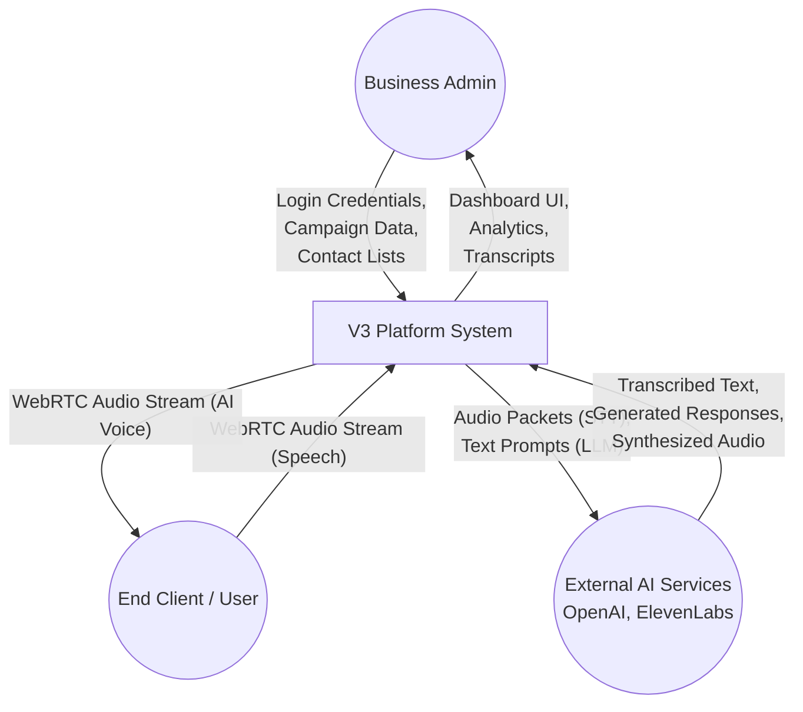
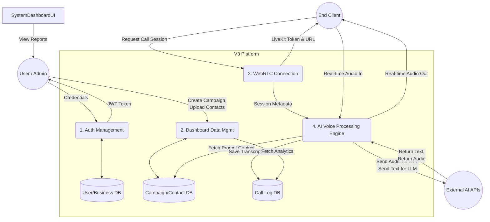
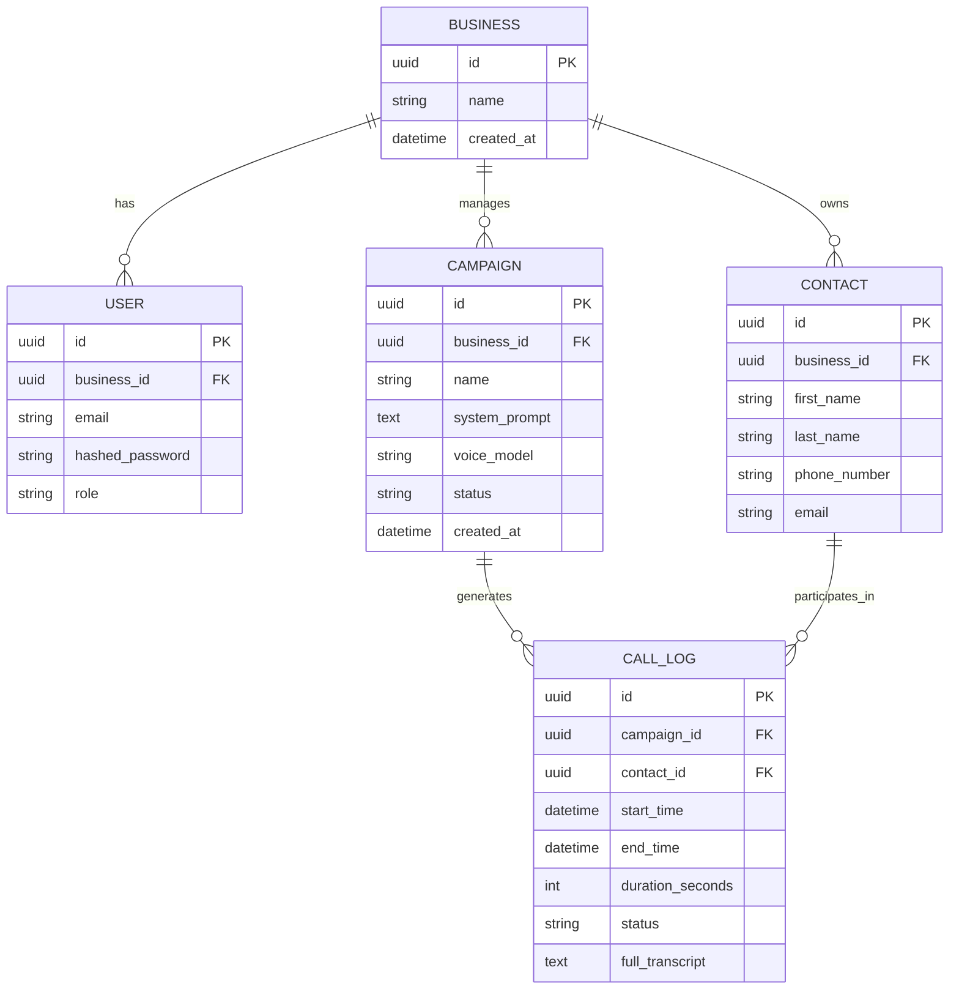

# V3 Platform: A Next-Generation Conversational Agent System
## Minor Project Report
---

### LIST OF ABBREVIATION

| S.NO. | Abbreviations | Meanings |
| :---: | :---: | :--- |
| 1 | AI | Artificial Intelligence |
| 2 | API | Application Programming Interface |
| 3 | CRUD | Create, Read, Update, Delete |
| 4 | DFD | Data Flow Diagram |
| 5 | ERD | Entity-Relationship Diagram |
| 6 | IVR | Interactive Voice Response |
| 7 | JWT | JSON Web Token |
| 8 | LLM | Large Language Model |
| 9 | ORM | Object-Relational Mapping |
| 10 | SaaS | Software as a Service |
| 11 | SRS | Software Requirements Specification |
| 12 | STT | Speech-to-Text |
| 13 | TTS | Text-to-Speech |
| 14 | UI | User Interface |
| 15 | WebRTC | Web Real-Time Communication |

 

### LIST OF TABLES

| Table N0. | Table Caption | Page No. |
| :---: | :--- | :---: |
| | (No tables currently in the report) | |

 

### LIST OF FIGURES

| Figure No. | Figure Caption | Page No. |
| :---: | :--- | :---: |
| Figure 1 | Context Flow Diagram (Level 0 DFD) | - |
| Figure 2 | Data Flow Diagram (Level 1 DFD) | - |
| Figure 3 | E-R Diagram (Entity-Relationship Diagram) | - |

---

### 1. Abstract

The rapid evolution of Artificial Intelligence, particularly in the domains of Natural Language Processing (NLP) and speech generation, has paved the way for highly sophisticated, automated conversational agents. This project, titled "V3 Platform," presents a comprehensive, real-time communication solution designed to handle inbound and outbound phone calls using advanced AI. By integrating Large Language Models (LLMs) with state-of-the-art Speech-to-Text (STT) and Text-to-Speech (TTS) technologies, the platform aims to simulate human-like conversations with minimal latency.

Traditional customer support and telemarketing systems rely heavily on human resources, which are inherently limited by availability, training costs, and scalability challenges. The V3 Platform addresses these pain points by offering a highly scalable, 24/7 available virtual agent capable of understanding context, managing multi-turn conversations, and dynamically generating responses based on predefined business logic and campaigns. 

The architecture of the system is built upon a modern, decoupled tech stack. The backend is powered by FastAPI, a high-performance Python framework, handling business logic, user management, and orchestration of AI services. The frontend utilizes Next.js and React to provide an intuitive, responsive dashboard for administrators to manage campaigns, contacts, and view detailed call analytics. Real-time audio streaming is facilitated through LiveKit, ensuring low-latency WebRTC communication between the user's browser or device and the AI agent.

This report outlines the complete software development lifecycle of the V3 Platform, detailing the system requirements, architectural design, data flow, and database schema. It serves as a comprehensive guide to understanding the theoretical and practical implementations of real-time AI conversational systems, highlighting the system's current capabilities, limitations, and potential for future expansion.

---

### 2. Objective

The primary objective of this project is to design, develop, and deploy a robust V3 Platform capable of conducting seamless, real-time voice conversations with users. Specifically, the project aims to achieve the following:

1. **Automate Conversational Workflows:** To replace manual calling processes with an AI-driven agent capable of conducting initial screenings, providing customer support, and executing telemarketing campaigns autonomously.
2. **Minimize Latency in Real-Time Interactions:** To achieve near-human conversation flow by reducing the latency between speech recognition, text generation, and audio synthesis using optimized WebRTC and streaming protocols.
3. **Provide Comprehensive Campaign Management:** To develop an intuitive frontend interface that allows businesses to easily create, configure, and monitor AI calling campaigns, complete with custom agent prompts and behaviors.
4. **Ensure Scalability and High Availability:** To design a microservices-inspired architecture that can handle concurrent call sessions without degradation in performance, ensuring the system can scale with business needs.
5. **Detailed Analytics and Logging:** To capture, transcribe, and analyze every call, providing business owners with actionable insights, call summaries, and performance metrics.
6. **Multi-Tenant Architecture:** To support multiple businesses or users on a single platform instance, ensuring secure data isolation and role-based access control.

---

### 3. Intro

The landscape of human-computer interaction is undergoing a paradigm shift. For decades, automated phone systems were synonymous with rigid, frustrating Interactive Voice Response (IVR) menus that required users to press keypad numbers or utter specific, constrained phrases. These legacy systems lacked context awareness, conversational flexibility, and the ability to handle complex queries, leading to poor customer experiences.

The advent of Large Language Models (LLMs), such as OpenAI's GPT series, combined with breakthroughs in low-latency Text-to-Speech (TTS) and Speech-to-Text (STT) models, has unlocked the potential for truly conversational AI. The V3 Platform is conceived to harness these cutting-edge technologies, bridging the gap between digital AI processing and telephonic communication.

This project involves the creation of a full-stack web application intertwined with a real-time voice processing pipeline. The backend, developed in Python using FastAPI, manages the core logic, interacting with various AI APIs to process user speech, generate intelligent responses, and synthesize human-like voice replies. It utilizes SQLAlchemy for Object-Relational Mapping (ORM) to manage a relational database containing users, businesses, campaigns, contacts, and detailed call logs.

The frontend is a modern web application built with Next.js, providing a dashboard for users to orchestrate their AI agents. Users can define the "persona" of the AI, upload contact lists, initiate calls, and review the outcomes through comprehensive transcripts and analytics. 

Real-time audio transmission is a critical component of this system. Traditional REST APIs are insufficient for the continuous, bidirectional flow of audio data required for a phone call. Therefore, the project integrates LiveKit, a powerful WebRTC infrastructure, to establish low-latency, peer-to-peer audio streams between the client interfaces and the AI processing backend. 

Through this synthesis of web development, AI integration, and real-time communication protocols, the V3 Platform represents a significant step forward in automated customer engagement.

---

### 4. Problem Statement

Modern businesses face a continuous challenge in managing customer communications efficiently while maintaining high quality and keeping costs manageable. The specific problems this project addresses include:

1. **High Operational Costs:** Maintaining a human-staffed call center involves significant expenses, including salaries, benefits, infrastructure, and ongoing training. For small to medium enterprises (SMEs), these costs can be prohibitive.
2. **Scalability Limitations:** Human workforces are difficult to scale rapidly. During peak hours, promotional events, or crises, call volumes can spike unexpectedly, leading to long wait times, abandoned calls, and dissatisfied customers.
3. **Inconsistent Quality and Compliance:** Human agents are susceptible to fatigue, emotional fluctuations, and errors. Ensuring consistent adherence to company scripts, compliance regulations, and quality standards across hundreds of agents is a monumental management challenge.
4. **Restricted Availability:** Providing true 24/7 customer support requires multiple shifts and significantly increases operational overhead. Most businesses are forced to restrict their support hours, frustrating customers in different time zones or those needing immediate assistance outside regular hours.
5. **Inefficient Lead Qualification:** In outbound campaigns, human agents spend a vast majority of their time navigating voicemails, gatekeepers, and uninterested prospects. This is a highly inefficient use of human talent, which is better suited for closing complex deals rather than initial screening.
6. **Legacy IVR Frustration:** Existing automated solutions (IVRs) are rigid and universally disliked by consumers. They cannot understand natural language or context, often trapping users in endless loops and failing to resolve their actual issues.

The V3 Platform aims to solve these problems by providing an intelligent, infinitely scalable, and always-available virtual workforce capable of handling both inbound inquiries and outbound campaigns with human-like conversational proficiency.

---

### 5. SYSTEM REQUIREMENTS SPECIFICATION (SRS)

This section provides a detailed Software Requirements Specification for the V3 Platform, outlining the precise functional and non-functional requirements necessary for the system's successful development and deployment.

#### 1. Intro

##### 1.1 Purpose
The purpose of this SRS document is to define the complete software architecture, system behaviors, and operational constraints of the V3 Platform. It serves as the primary reference document for developers, quality assurance testers, project managers, and stakeholders to ensure a unified understanding of the product being built. It acts as a blueprint for the system's design and implementation phases.

##### 1.2 Scope
The V3 Platform is a web-based SaaS (Software as a Service) application combined with a real-time voice processing backend. 
**In-Scope:**
*   User registration and authentication (JWT-based).
*   Multi-tenant business account management.
*   Campaign creation, defining AI persona, objectives, and scripts.
*   Contact list management (CRUD operations).
*   Real-time voice calling interface using WebRTC (LiveKit).
*   Integration with external AI APIs (LLM for text generation, STT for transcription, TTS for voice synthesis).
*   Call logging, transcript storage, and basic analytics dashboard.
**Out-of-Scope:**
*   Direct integration with traditional PSTN (Public Switched Telephone Network) carriers in the initial phase (calls are browser-to-browser or browser-to-server initially).
*   Advanced emotion recognition from voice.
*   Native mobile applications (iOS/Android).

##### 1.3 Definitions & Abbreviations
*   **AI (Artificial Intelligence):** The simulation of human intelligence processes by machines.
*   **API (Application Programming Interface):** A set of rules that allows different software entities to communicate.
*   **CRUD (Create, Read, Update, Delete):** The four basic functions of persistent storage.
*   **DFD (Data Flow Diagram):** A graphical representation of the flow of data through an information system.
*   **ERD (Entity-Relationship Diagram):** A structural diagram for use in database design.
*   **JWT (JSON Web Token):** An open standard for securely transmitting information between parties as a JSON object.
*   **LLM (Large Language Model):** A deep learning algorithm that can recognize, summarize, translate, predict and generate text.
*   **ORM (Object-Relational Mapping):** A programming technique for converting data between incompatible type systems in object-oriented programming languages.
*   **SaaS (Software as a Service):** A software licensing and delivery model in which software is licensed on a subscription basis and is centrally hosted.
*   **STT (Speech-to-Text):** Technology that converts spoken language into written text.
*   **TTS (Text-to-Speech):** Technology that converts normal language text into speech.
*   **WebRTC (Web Real-Time Communication):** A free and open-source project providing web browsers and mobile applications with real-time communication via simple APIs.

#### 2. Overall Description

##### 2.1 Product Perspective
The V3 Platform operates as an independent, cloud-hosted web application. It functions as a bridge between end-users (making or receiving calls via their browser) and external AI service providers (OpenAI, Deepgram, ElevenLabs, etc.). The system utilizes a PostgreSQL database for persistent storage of structured data and integrates with LiveKit cloud or a self-hosted LiveKit server to manage the WebRTC signaling and media routing. 

##### 2.2 Product Functions
The core functions of the system are categorized as follows:
*   **Administrative Functions:** User signup, login, password management, business profile setup, and billing management.
*   **Configuration Functions:** Creating campaigns, writing AI system prompts, selecting voice models, and configuring call parameters.
*   **Data Management:** Uploading and managing contact lists, viewing call histories, reading transcripts, and analyzing campaign success rates.
*   **Execution Functions:** Initiating real-time audio sessions, performing Voice Activity Detection (VAD), processing STT, generating LLM responses, and streaming TTS audio back to the user.

##### 2.3 User Characteristics
The system caters to two primary user profiles:
*   **System Administrators (Super Admin):** Technical personnel responsible for maintaining the platform, managing overall tenant accounts, monitoring server health, and configuring global API keys.
*   **Business Users (Tenants/Clients):** Non-technical users such as sales managers, customer support leads, or business owners. They use the platform to run campaigns, manage their contacts, and review analytics. They expect an intuitive, clean, and responsive user interface.

##### 2.4 Constraints
*   **Latency Constraints:** The end-to-end latency (from the moment a user stops speaking to the moment the AI starts replying) must be kept strictly under 1000-1500 milliseconds to maintain conversational naturalness.
*   **API Rate Limits:** The system is heavily dependent on external third-party APIs (LLMs, TTS). It must intelligently handle rate limits, retry mechanisms, and potential downtime of these external services.
*   **Browser Compatibility:** WebRTC functionality requires modern web browsers. The platform is constrained to users operating updated versions of Chrome, Firefox, Safari, or Edge.
*   **Privacy and Security:** Processing voice data and potential Personally Identifiable Information (PII) imposes strict constraints regarding data encryption at rest and in transit, and compliance with data protection regulations.

#### 3. Functional Requirements

*   **FR-1: Authentication and Authorization**
    *   **FR-1.1:** The system shall allow users to register with an email and password.
    *   **FR-1.2:** The system shall securely hash passwords using bcrypt before database storage.
    *   **FR-1.3:** The system shall issue a JWT upon successful login for session management.
    *   **FR-1.4:** The system shall implement Role-Based Access Control (RBAC) separating Super Admins from standard Business Users.
*   **FR-2: Business Profile Management**
    *   **FR-2.1:** A user shall be able to create and manage a 'Business' entity.
    *   **FR-2.2:** The system shall isolate data (campaigns, contacts, calls) strictly within the boundary of a Business (Multi-tenancy).
*   **FR-3: Campaign Management**
    *   **FR-3.1:** Users shall be able to create, read, update, and delete (CRUD) outbound or inbound campaigns.
    *   **FR-3.2:** A campaign shall require a defined 'System Prompt' (the instructions for the LLM).
    *   **FR-3.3:** Users shall be able to select specific Voice models (e.g., male, female, specific accents) for each campaign.
*   **FR-4: Contact Management**
    *   **FR-4.1:** Users shall be able to manually add contacts (Name, Phone Number, Email).
    *   **FR-4.2:** Users shall be able to import contacts in bulk via CSV upload.
    *   **FR-4.3:** The system shall validate phone number formats upon entry or import.
*   **FR-5: Call Execution Engine (Real-Time)**
    *   **FR-5.1:** The system shall generate temporary secure tokens for clients to connect to the LiveKit WebRTC room.
    *   **FR-5.2:** The system shall capture user audio via the client's microphone.
    *   **FR-5.3:** The system shall implement Voice Activity Detection (VAD) to determine when the user starts and stops speaking.
*   **FR-6: AI Processing Pipeline**
    *   **FR-6.1:** Upon detecting the end of user speech, the system shall stream the audio buffer to a Speech-to-Text service.
    *   **FR-6.2:** The resulting text transcript shall be appended to the conversational context and sent to the LLM (e.g., GPT-4).
    *   **FR-6.3:** The LLM's text response shall be streamed to a Text-to-Speech engine.
    *   **FR-6.4:** The generated synthesized audio shall be streamed back through LiveKit to the user's speaker.
*   **FR-7: Call Logging and Analytics**
    *   **FR-7.1:** The system shall record the start time, end time, and duration of every call.
    *   **FR-7.2:** The system shall save the complete textual transcript of the conversation in the database.
    *   **FR-7.3:** The dashboard shall display metrics such as total calls made, average call duration, and campaign success rates.

#### 4. Non-Functional Requirements

##### 4.1 Performance
*   **Response Time:** The dashboard UI must load within 2 seconds. API responses for CRUD operations must complete within 300ms.
*   **Conversational Latency:** The AI voice processing pipeline must strive for a maximum of 1.5 seconds turnaround time from user silence to AI audio playback.
*   **Throughput:** The backend architecture must be capable of handling at least 100 concurrent voice streams per server instance.

##### 4.2 Usability
*   **Intuitive UI:** The frontend must utilize modern UI/UX principles, providing clear navigation, helpful tooltips, and straightforward form validations.
*   **Responsive Design:** The dashboard must be fully functional and aesthetically pleasing across desktop, tablet, and mobile device screens.
*   **Error Handling:** The system must provide clear, user-friendly error messages (e.g., "Microphone access denied," "Network connection lost") rather than raw technical stack traces.

##### 4.3 Compatibility
*   **Browser Support:** Fully compatible with Google Chrome (latest 3 versions), Mozilla Firefox, Apple Safari, and Microsoft Edge.
*   **API Standards:** The backend API must adhere to RESTful principles and return standardized JSON responses.

##### 4.4 Limitations
*   **Network Dependency:** The core functionality (voice calling) is highly susceptible to the user's internet connection quality. High packet loss or jitter will severely degrade the experience.
*   **Cost Dependency:** Scaling the system directly correlates with increased costs paid to API providers (OpenAI, ElevenLabs, etc.) based on token usage and audio minute generation.
*   **Hallucination Risk:** As with all LLM-based systems, there is a non-zero risk of the AI generating false or misleading information ("hallucinations"), necessitating careful prompt engineering and guardrails.

#### 5. System Requirements

##### 5.1 Hardware Requirements
*   **Development Environment:** 
    *   Processor: Intel Core i5 or AMD Ryzen 5 equivalent or better.
    *   RAM: 16 GB minimum.
    *   Storage: 256 GB SSD.
*   **Production Server (Backend & Agent Worker):**
    *   Processor: 4-8 vCPUs.
    *   RAM: 16-32 GB (depending on concurrent call volume).
    *   Network: High-bandwidth connection with low latency to API provider data centers.
*   **Client (End User):**
    *   Standard modern PC, laptop, or smartphone with a functioning microphone and speakers/headphones.

##### 5.2 Software Requirements
*   **Backend Framework:** Python 3.10+, FastAPI framework, Uvicorn ASGI server.
*   **Frontend Framework:** Node.js, Next.js 14+, React 18+, Tailwind CSS.
*   **Database:** PostgreSQL 14+ for relational data storage. SQLAlchemy for ORM. Alembic for database migrations.
*   **Real-time Communication:** LiveKit Server, `livekit-server-sdk-python`, `@livekit/components-react`.
*   **AI Integration Libraries:** `openai` Python SDK.

---

### 6. Context Flow Diagram (Level 0 DFD)

The Context Flow Diagram illustrates the entire V3 Platform as a single high-level process, demonstrating how it interacts with external entities.

**Textual Description:**
The central hub is the "V3 Platform System." It interacts with three primary external entities:
1.  **Business Admin/User:** Interacts with the system via HTTP/HTTPS to manage data (campaigns, contacts) and view reports.
2.  **End Client (Caller/Callee):** Interacts with the system via WebRTC to send and receive real-time audio streams.
3.  **External AI Services:** The system sends text/audio and receives processed audio/text from third-party APIs (LLM, TTS, STT).

**Mermaid Diagram (For rendering or reference):**

---

### 7. Data Flow Diagram (Level 1 DFD)

The Level 1 DFD breaks down the single process of the Context Diagram into major sub-processes, showing the flow of data stores.

**Textual Description:**
The system is divided into four main processes:
1.  **Authentication & Authorization Management:** Validates credentials and issues JWTs. Accesses the User Database.
2.  **Dashboard Data Management:** Handles CRUD operations for Business, Campaigns, and Contacts. Updates the respective database tables.
3.  **WebRTC Connection Manager:** Handles the initialization of LiveKit rooms and token generation for clients.
4.  **AI Voice Processing Engine:** The core loop. It receives audio from the client, sends it for transcription, queries the LLM with campaign context, synthesizes speech, and sends audio back. It saves transcripts to the Call Log Database.

**Mermaid Diagram:**

---

### 8. E-R Diagram (Entity-Relationship Diagram)

The E-R Diagram defines the data structure and how different entities relate to one another within the PostgreSQL database.

**Textual Description:**
*   **User Entity:** Stores login credentials and roles. A User belongs to a Business.
*   **Business Entity:** Represents the tenant account. It has a one-to-many relationship with Users, Campaigns, and Contacts.
*   **Campaign Entity:** Contains configuration for AI calls (System Prompt, voice ID, active status). It belongs to a Business.
*   **Contact Entity:** Represents a person to be called. Contains name, phone number. Belongs to a Business and can be linked to a Campaign.
*   **CallLog Entity:** Represents a single call instance. Contains start time, duration, status, and the full text transcript. It links to a specific Campaign and a specific Contact.

**Mermaid Diagram:**

---

### 9. Conclusion

The V3 Platform demonstrates the immense potential of integrating modern web technologies with advanced Artificial Intelligence models. By successfully establishing a low-latency, real-time voice pipeline over WebRTC and connecting it to powerful LLMs, this project proves that conversational AI can move beyond simple text-based chatbots and into the realm of fluid, human-like verbal communication.

The modular architecture, separating the Next.js frontend, FastAPI backend, and AI worker nodes, ensures that the system is scalable, maintainable, and robust. The platform empowers businesses to drastically reduce their operational overhead associated with customer support and telemarketing while maintaining a high standard of conversational quality and consistency. 

Through the implementation of a comprehensive dashboard, administrators gain unprecedented control over their virtual agents, able to fine-tune system prompts and analyze rich, transcribed call logs. The successful completion of this project highlights a significant milestone in automated communication systems, paving the way for wider adoption of AI-driven voice agents across various industries.

---

### 10. Limitation

While the V3 Platform represents a significant technological achievement, it is constrained by several current limitations:

1.  **Latency Inherent in APIs:** The system relies on cloud-based APIs for Speech-to-Text, Large Language Models, and Text-to-Speech. The cumulative network latency and processing time of these three external hops can occasionally result in unnatural pauses in the conversation, especially if the user's or server's internet connection experiences jitter.
2.  **Interruption Handling (Barge-in):** Handling human interruptions (barge-in) gracefully remains a complex challenge. If a user interrupts the AI while it is speaking, the system must immediately halt the TTS stream, process the new audio, and generate a contextual response. Achieving seamless barge-in requires highly optimized Voice Activity Detection (VAD) algorithms and precise timing.
3.  **Hallucinations and Unpredictability:** LLMs are probabilistic models. Despite rigorous prompt engineering and constraints, there remains a risk that the AI may generate inaccurate, inappropriate, or out-of-context information (hallucinations).
4.  **Language and Accent Limitations:** While STT and TTS models are improving rapidly, their accuracy can degrade significantly when dealing with heavy regional accents, background noise, or languages other than heavily resourced ones like English.
5.  **Lack of Emotional Intelligence:** The current AI models excel at understanding text context but lack true emotional intelligence. They cannot accurately detect nuances in human tone, sarcasm, or frustration, potentially leading to empathetic disconnects during sensitive customer support interactions.

---

### 11. Future Scope or Updation

The foundation laid by this project opens numerous avenues for future enhancements and features:

1.  **Telephony (SIP/PSTN) Integration:** Transitioning from browser-only WebRTC calls to integrating with providers like Twilio or Vonage to allow the AI to make and receive calls directly to and from standard telephone numbers.
2.  **Advanced Sentiment Analysis:** Implementing real-time sentiment analysis on the user's speech to dynamically adjust the AI's tone and prompt based on whether the user sounds angry, happy, or confused.
3.  **CRM Integration:** Developing direct integrations (webhooks/APIs) with popular Customer Relationship Management (CRM) platforms like Salesforce, HubSpot, or Zoho to automatically sync call logs, transcripts, and lead statuses.
4.  **Multilingual Support & Live Translation:** Enhancing the pipeline to automatically detect the spoken language, translate it, process it via the LLM, and synthesize speech back in the detected language, enabling global support capabilities.
5.  **Knowledge Base (RAG) Integration:** Implementing Retrieval-Augmented Generation (RAG) by connecting the LLM to a company's internal documentation, FAQs, or databases, allowing the AI to answer highly specific, factual questions accurately.
6.  **Transfer to Human Agent:** Implementing a crucial fallback mechanism where the AI, upon detecting a complex issue or an extremely frustrated customer, automatically routes the active call and transcript to an available human agent.

---

### 12. Bibliography

1.  **Next.js Documentation.** Vercel Inc. *Next.js: The React Framework for the Web.* Available at: https://nextjs.org/docs
2.  **FastAPI Documentation.** Sebastián Ramírez. *FastAPI: High performance, easy to learn, fast to code, ready for production.* Available at: https://fastapi.tiangolo.com/
3.  **LiveKit Documentation.** LiveKit. *Real-time audio and video infrastructure.* Available at: https://docs.livekit.io/
4.  **OpenAI API Reference.** OpenAI. *GPT-4 and Text-to-Speech API documentation.* Available at: https://platform.openai.com/docs/
5.  **SQLAlchemy Documentation.** *The Python SQL Toolkit and Object Relational Mapper.* Available at: https://docs.sqlalchemy.org/
6.  **WebRTC Architecture.** W3C & IETF. *Web Real-Time Communications standards and protocols.*
7.  Vaswani, A., et al. (2017). "Attention Is All You Need." *Advances in Neural Information Processing Systems*. 
8.  Radford, A., et al. (2018). "Improving Language Understanding by Generative Pre-Training." *OpenAI*.
